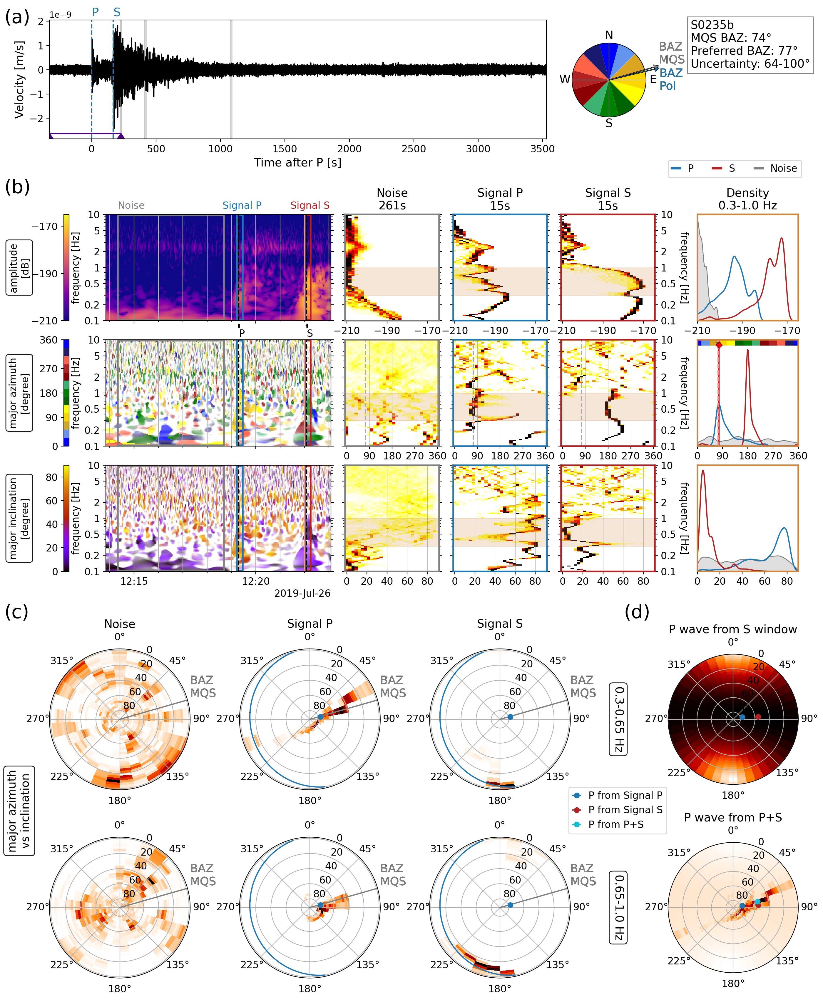

# Polarisation Analysis 

## Introduction
This package uses seismic data and applyies a polarisation analysis to obtain a back azimuth based on an arriving wave.
Originally used for Martian seismic data from the InSight mission, it can also be applied to earthquake data or synthetics.

A detailed description of the method and resulting plot can be found in [BSSA](https://pubs.geoscienceworld.org/ssa/bssa/article/112/4/1787/613988/Low-Frequency-Marsquakes-and-Where-to-Find-Them), or, in the absence of institutional access, [arXiv](https://arxiv.org/abs/2204.12959).


## Reference
Géraldine Zenhäusern, Simon C. Stähler, John F. Clinton, Domenico Giardini, Savas Ceylan, Raphaël F. Garcia; Low‐Frequency Marsquakes and Where to Find Them: Back Azimuth Determination Using a Polarization Analysis Approach. *Bulletin of the Seismological Society of America* **2022**; 112 (4): 1787–1805. doi: https://doi.org/10.1785/0120220019


## Code
The code can output either only a back azimuth with uncertainty (obtained for the first supplied time-frequency window), or it can produce a comprehensive polarisation plot (as in [BSSA](https://pubs.geoscienceworld.org/ssa/bssa/article/112/4/1787/613988/Low-Frequency-Marsquakes-and-Where-to-Find-Them), [arXiv](https://arxiv.org/abs/2204.12959)).
It is recommended to produce the plots so any time-frequency tradeoffs can be analysed more carefully.


## How to use
The code is set up to run from the command line, e.g.
```
python polarisation_main.py 'Data/*.mseed' -p --name 'test'
```
This produces a plot called 'test.png' in a subfolder called 'Plots' from mseed files stored in 'Data'. To change the save location, please adjust the code at the end of `plot_polarization_event_noise` in the [plot code](./polarisation_package/polarisation_plot.py). The data location should be given in '', otherwise there is a shell issue with wildcards.
To omit the plot and simply get the back azimuth estimate, leave out -p (and --name).

In the [main code](./polarisation_package/polarisation_main.py), timings for P, S, and noise (or other phases!) should be added. If desired, the time windows and frequency band can also be adjusted. Most polarisation tweaks can be made within that file when calling `plot_polarization_event_noise`.

## License
This project is licensed under the terms of the GPLv3 license.

Copyright (C) 2022  Géraldine Zenhäusern (geraldine@zenhausern.net), Simon Stähler (mail@simonstaehler.com), Martin van Driel (Martin@vanDriel.de)

This program is free software: you can redistribute it and/or modify
it under the terms of the GNU General Public License as published by
the Free Software Foundation, either version 3 of the License, or
 any later version.

This program is distributed in the hope that it will be useful,
but WITHOUT ANY WARRANTY; without even the implied warranty of
MERCHANTABILITY or FITNESS FOR A PARTICULAR PURPOSE.  See the
GNU General Public License for more details.

You should have received a copy of the GNU General Public License
along with this program.  If not, see [here](https://www.gnu.org/licenses/).


## Notes
There are some artifacts of InSight data processing in the code (e.g. 1 Hz tick removal option, using manual back azimuths). In case anyone wants to use this code for an analysis of this data set, they were left in the code.
Some terminology in variable naming is also InSight-based, but is explained in comments of the respective functions.

* Data should be in an ObsPy compatible format
* Data should be instrument corrected and rotated to ZNE. There is an option to rotate the traces to ZRT/LQT using a supplied catalog back azimuth
* Data should be in velocity, or displacement with `differentiate = True`. The code runs in any case, but the plot labels were made for velocity data
* Ellipticity data is currently not plotted, but can be added/swaped in the code. There is an example comment in the [plot code](./polarisation_package/polarisation_plot.py)
* If no second signal window is needed, use `phase_S = '-'`. The histogram plots will then remain empty. Supply some dummy time to `timing_S` in that case 


The output plot follows this style (example of marsquake S0235b):

